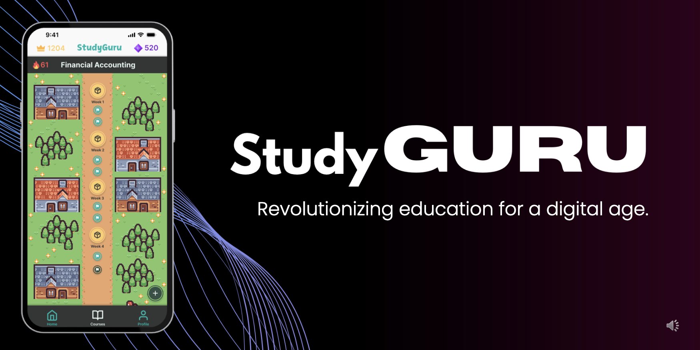

# StudyGURU

StudyGURU is an ***AI-powered educational platform*** designed to democratize access to personalized education. By leveraging Generative AI, we aim to provide high-quality, adaptive learning experiences at a fraction of the cost of traditional tuition, making quality education accessible to students from all socioeconomic backgrounds.

## Overview
StudyGURU is an AI-powered educational platform designed to democratize access to personalized education. By leveraging Generative AI, we aim to provide high-quality, adaptive learning experiences at a fraction of the cost of traditional tuition, making quality education accessible to students from all socioeconomic backgrounds. StudyGURU addresses the inequitable access to personalized education by offering AI-driven personalized learning that is both scalable and affordable.

## Features
| Feature | Description | Status |
|---------|-------------|--------|
| **Gamified Learning Roadmap** | Interactive learning paths that incentivize consistent practice with progress tracking and short-form challenges. | ✅ Implemented |
| **AI Quiz Generation** | Dynamically generated quizzes tailored to individual learning needs, built on user-uploaded notes with diverse question formats. | ✅ Implemented |
| **AI Review and Feedback** | Immediate, thorough feedback on incorrect answers with detailed explanations to help rectify misconceptions, encouraging self-directed learning through contextual guidance. | ✅ Implemented |

## Technical Implementations
- **RAG Framework** - [View Code](https://github.com/Luanjie-Dong/StudyGuru/blob/main/model/StudyGuru.py)
  - Implements Retrieval-Augmented Generation (RAG) to enhance information retrieval. It includes topic summarization to enrich chunk information and a reranking mechanism to ensure relevant answers. Utilizes technologies like HuggingFace embeddings, Pinecone for vector storage, and custom classes for document processing and retrieval.

- **Quiz Generation** - [View Code](https://github.com/Luanjie-Dong/StudyGuru/blob/main/model/main.py)
  - Enables the creation of quizzes, topic generation, quiz review, question generation, challenge questions, and question formatting, leveraging AI to tailor educational content.

- **Data Processing and Cleaning** - [View Code](https://github.com/Luanjie-Dong/StudyGuru/blob/main/model/cleaner.py)
  - Cleans and preprocesses text data from various sources to ensure high-quality input for the AI models, improving accuracy and reliability of the generated content.

## Running the Application
Follow these steps to run the application:

1. **Start the Application**
    - Use Docker Compose to set up and run the application. Execute the command `docker compose -up` in the project directory.

## Future Development
The roadmap for StudyGURU includes expanding question formats through multi-modal generation, providing various flavors of feedback and explanation to suit different learning styles, and providing classroom integration to support out-of-class learning in traditional education instituitions.

## Contributors

## References
- [LlamaIndex](https://www.llamaindex.ai/)
- [HuggingFace](https://huggingface.co/)
- [Pinecone](https://www.pinecone.io/)
- [Sentence Transformers](https://www.sbert.net/)

